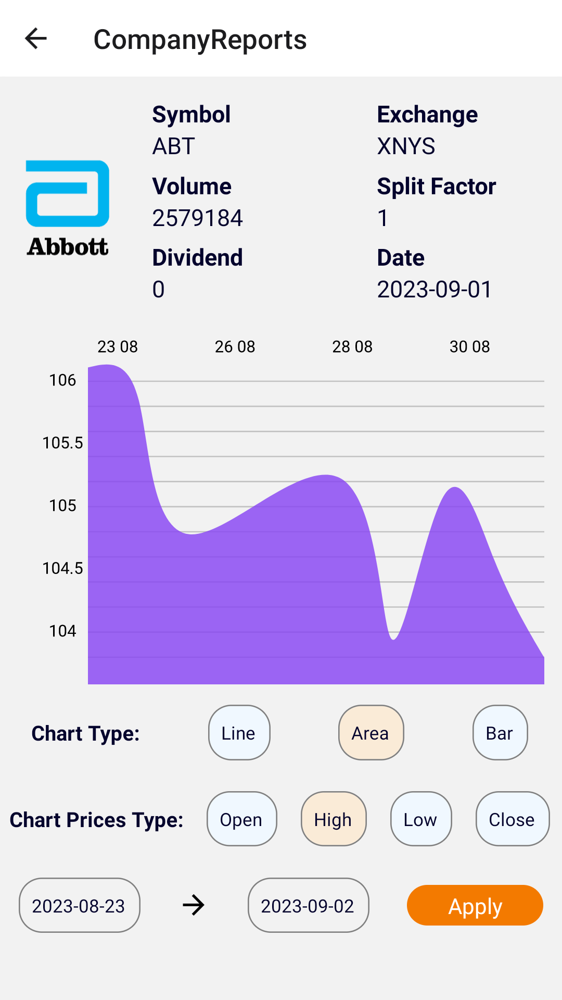
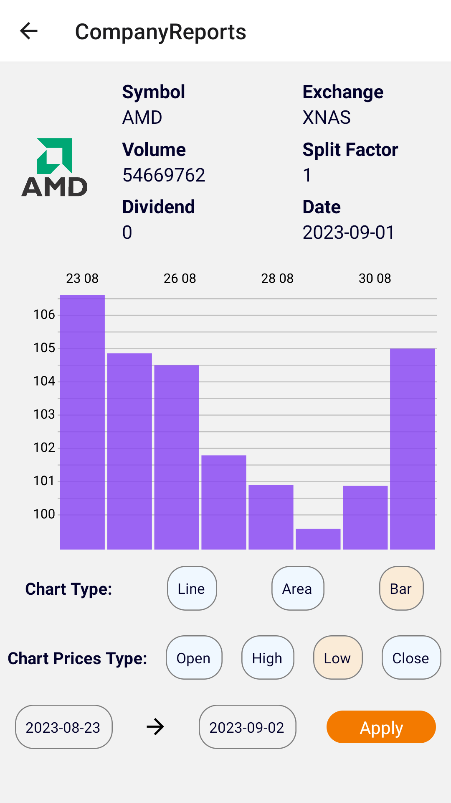
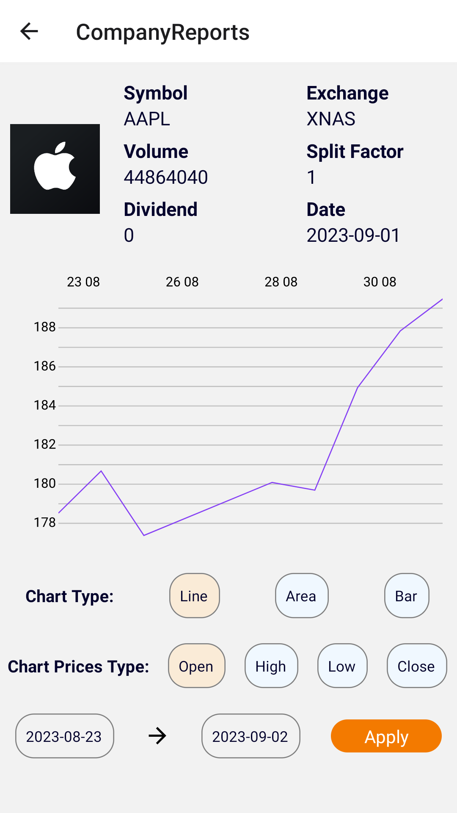

# Basalt Trading App
* This is a mobile application sample that provides trading services.
* This application is developed using React-Native.

### Photos of The Application

        

# You Can Do... 
### As User
* You can check the companies list.
* You can view company reports and details.
* You can view charts.
* You can check data at a specific date range.

## Install
* you must have nodejs on your machine

## Run the React project
* 1 ) Download the React project.
* 2 ) Enter the React-Native project folder.
* 3 ) Run 'yarn install' from the command line.
* 4 ) Run 'react-native run-android' for android and 'react-native run-ios' for iOS from the command line.
